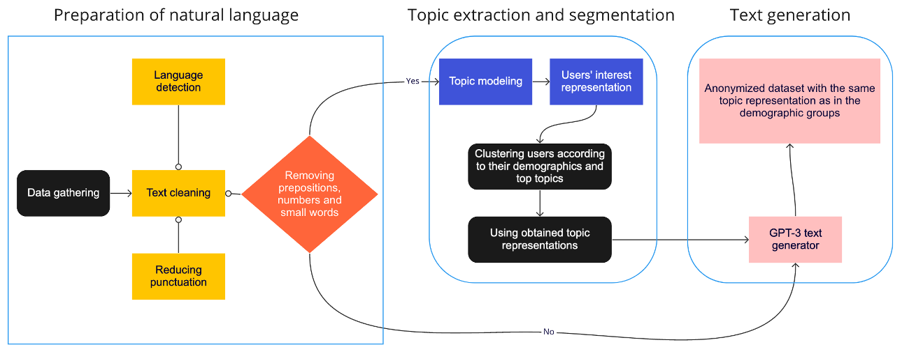

# Text data anonymization of social network users based on vector representations of their interests
Main target of the research is to provide text generation based on the topics representations to ensure high-quality anonymization of personal texts while maintaining the distribution of interests of the initial data.
The objectives of the study are 
    to try out different methods of topic modeling and labeling of the dataset and look through the quality of their results; 
    segmentation of the users according to their topics’ representation and demographic data; creating of new representations and imbedding it into the text generation pipeline.; 
    generation of fully anonymized dataset according to the obtained representations; testing and evaluation of the created pipeline 

 (*Suggested approach for text anonymization algorithm*)
To achieve the purpose of the research (to create a generative model out of word embedding which will take into the account the main interests of social media users and will match the requirements of differential privacy) there was created a pipeline of the research. 

# TopicModeling
 Research done by student of ITMO university Chizhevskiy Vladimir
Initial part of the work is related to topic modeling of the dataset of social media.
Up-to-date version in Google Colab groups dataset: 

Up-to-date version in Google Colab users dataset: 

# New
Up-to-date version in Google Colab text generation: 
      