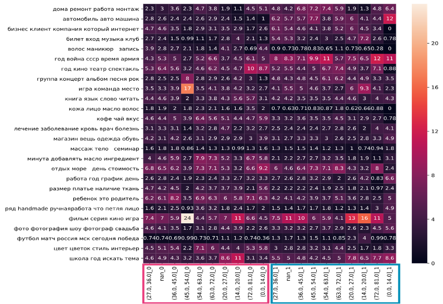

# Text data anonymization of social network users based on vector representations of their interests
Main target of the research was to provide text generation based on the topics representations to ensure high-quality anonymization of personal texts while maintaining the distribution of interests of the initial data.
The objectives of the study are 
- to try out different methods of topic modeling and labeling of the dataset and look through the quality of their results; 
- segmentation of the users according to their topics’ representation and demographic data; creating of new representations and imbedding it into the text generation pipeline.; 
- generation of fully anonymized dataset according to the obtained representations; testing and evaluation of the created pipeline 

 (*Suggested approach for text anonymization algorithm*)

To achieve the purpose of the research (to create a generative model out of word embedding which will take into the account the main interests of social media users and will match the requirements of differential privacy) there was created a pipeline of the research. 

# TopicModeling

First it was needed to provide a good quality topic modeling.
Latest version in Google Colab: 

The result of using ARTM algorithm can be presented as theta matrix (documents|topics distribution).
After labeling the obtained topics there appeared the possibility to assign the interests to the users according to their list of groups in social network.

To visualize the difference between all the age/sex segments there was taken mean value of the most allocated clusters of each topic for each segment 

(*The mean results for demographic groups.*)

# Results
Motivated intruider testing results: 
- Test with reidentification rate 98.5%
- 7% of targeted records that pose reidentification risk
The representations given as an input to the created model can be recreated with the cosine similarity of 0.95 in the new synthetic user feed which is fully anonymized.

To generate differentialy private datasets I used pre-treained network: 

The example of differetialy private social media feed which was created using the given algorithm.

*Example of the synthetic feed created using the topic representation of particular demographic group: men aged between 63 and 72.*
For this particular user the representation of interests was chosen as the one replicating the existing cluster for the demographic group of men with the age between 63 and 72: Vacations – 7.1%, Art & Theaters – 7.4%, House renovation – 5.9%, Cars – 5.9%, etc.

Formal results:

- Created reproducible models for extracting users interest representations
- Created and tested the algorithm for anonymization of datasets based on the semantics of any topic representation 
